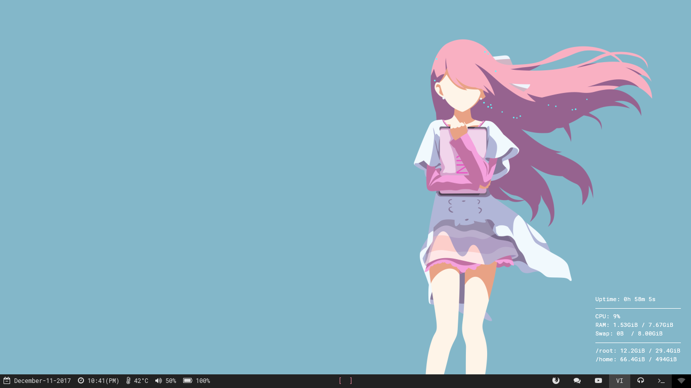
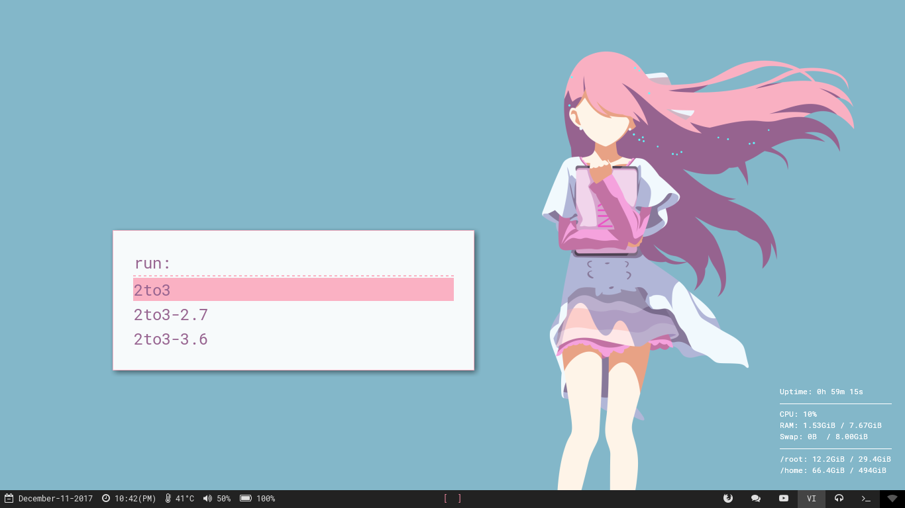
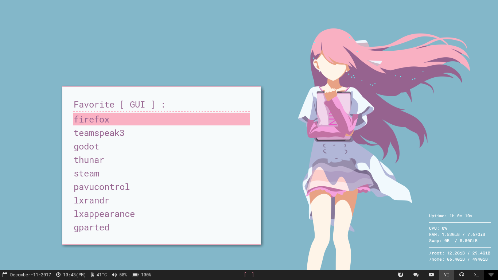
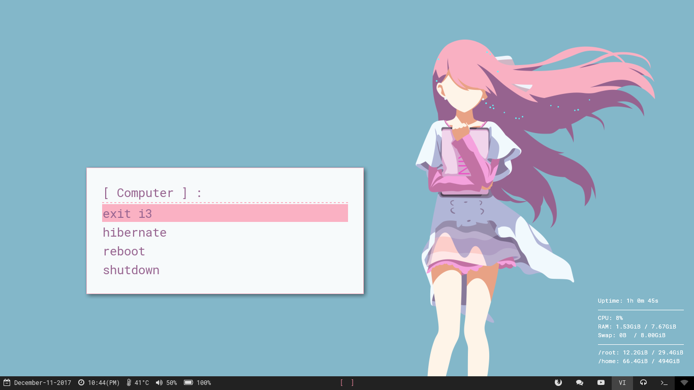
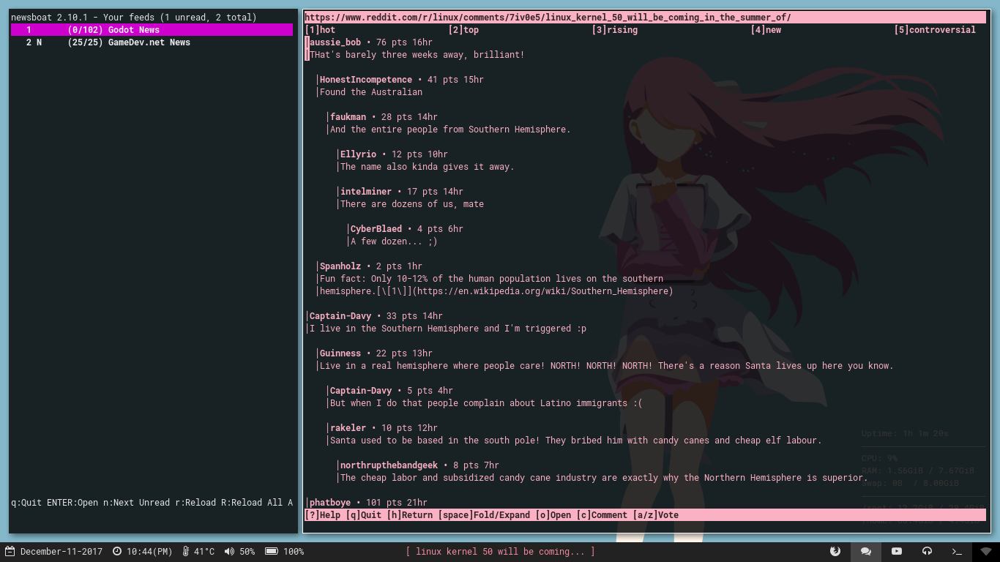
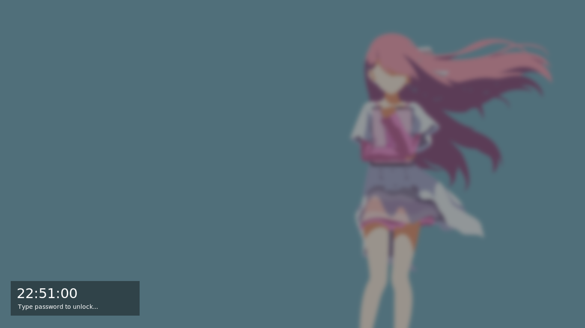
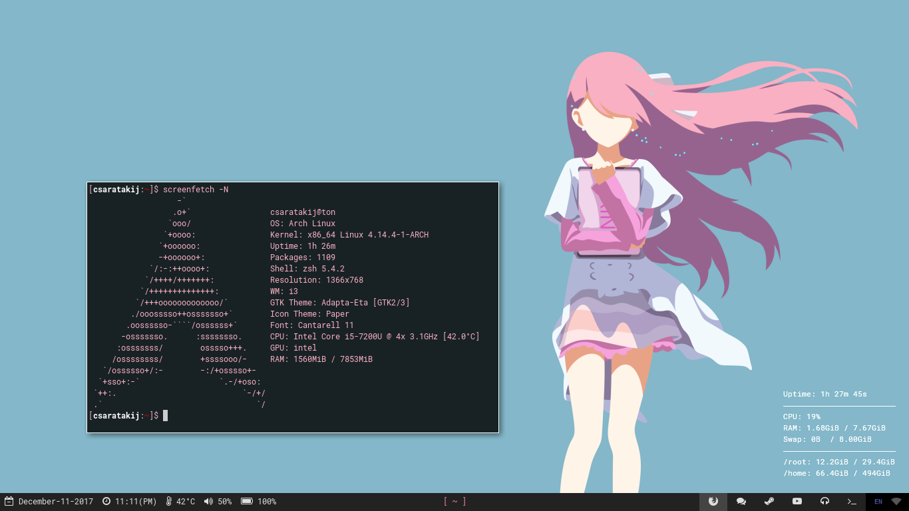

# i3 rice : Rin (Shelter)

# Video Showcase
- [video](https://youtu.be/Jn0nibjObqg)

# Config Directory
- Copy "i3-gaps/*" to "~/.config/i3"
- Copy "cava/*" to "~/.config/cava"
- Copy "conky/*" to "~/.config/conky"
- Copy "polybar/*" to "~/.config/polybar"
- Copy "tools/*" to "~/Tools/bin"
- Copy "newsboat/*" to "~/.newsboat"
- Copy "vim/vimrc" to "~/.vimrc"
- Copy "x11/Xdefaults" to "~/.Xdefaults"
- Copy "x11/Xresources" to "~/.Xresources"
- Copy "x11/xinitrc" to "~/.xinitrc"
- Copy "zsh/zshrc" to "~/.zshrc"
- Move "/usr/share/cmus/default.theme" to "default_ori.theme" && Copy "cmus/default.theme" to "~/.config/cmus"

# Dependencies
- [i3-gaps](https://github.com/Airblader/i3)
- [polybar](https://github.com/jaagr/polybar)
- [rofi](https://github.com/DaveDavenport/rofi)
- [betterlockscreen](https://github.com/pavanjadhaw/betterlockscreen)
- [FontAwesome](https://github.com/FortAwesome/Font-Awesome)
- [powerline (fonts)](https://github.com/powerline/fonts)
- [Noto Sans](https://fonts.google.com/specimen/Noto+Sans)
- [Roboto](https://fonts.google.com/specimen/Roboto)
- [RobotoMono](https://fonts.google.com/specimen/Roboto+Mono)
- [screenfetch](https://github.com/KittyKatt/screenFetch)
- [cava](https://github.com/karlstav/cava)
- rtv
- newsboat
- cmus
- feh
- scrot
- imagemagick
- ibus
- xfce4-screenshooter
- st (with alpha patch)
- zsh
- [oh-my-zsh](https://github.com/robbyrussell/oh-my-zsh)
- gtk3
- [ag](https://github.com/ggreer/the_silver_searcher)
- xdg-user-dirs
- vim
- [fdir](https://github.com/RealtimeBagIdea/FDir)
- nm-applet
- xrdb

# Desktop themes
- [adapta-gtk-theme](https://github.com/adapta-project/adapta-gtk-theme)
- [paper-icon-theme](https://github.com/snwh/paper-icon-theme)

# Zsh theme
- [mh](https://github.com/robbyrussell/oh-my-zsh/blob/master/themes/mh.zsh-theme)

# Wallpaper
- [rin](https://insanitykitsune.deviantart.com/art/Rin-Shelter-Wallpaper-647774231)

